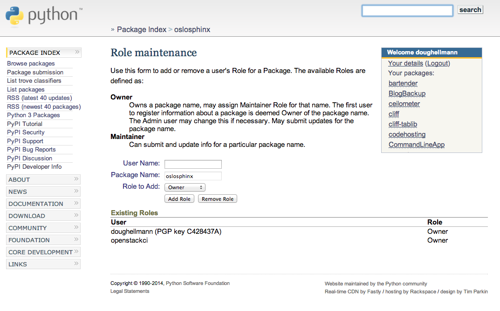

:title: Project Creator's Guide

========================
 Project Creator's Guide
========================

Before You Start
================

This is a long document. It's long because it has to be, not because
we want it to be. If you follow it, everything will be fine.

It is important that you perform all of the steps, in the order they
are given here. Don't skip any steps. Don't try to do things in
parallel. Don't jump around.

If your project is already set up in the OpenStack CI infrastructure,
you might want to see :ref:`zuul_best_practices` for information on
adding new tests to a repository.

Decide Status of your Project
=============================

The OpenStack CI infrastructure can be used both by official OpenStack
projects and also by OpenStack-related projects.

Official projects are those that have applied for this status with the
technical committee. The `governance site`_ contains details on how
to become one and the list of current `OpenStack Project Teams`_. The
`Project Team Guide`_ explains how OpenStack project teams work.

If you add a new repository, you can make it part of an existing
official OpenStack project, use it to start a new official project, or
start as a related project, also known as a `StackForge`_ project.

Note that only official OpenStack projects may use certain parts of
the OpenStack infrastructure, especially the docs.openstack.org and
specs.openstack.org server.

.. _governance site: https://governance.openstack.org
.. _OpenStack Project Teams: https://governance.openstack.org/reference/projects/index.html
.. _Project Team Guide: https://docs.openstack.org/project-team-guide/
.. _StackForge: https://docs.openstack.org/infra/system-config/stackforge.html

Choosing a Good Name for Your Project
=====================================

It is important to choose a descriptive name that does not conflict
with other projects. There are several places you'll need to look to
ensure uniqueness and suitability of the name.

.. note::

   If you encounter any issues establishing a valid unique name across
   all of the tools we use, consult with the Release Manager before
   going any further.

Character Set
-------------

We prefer to use names made up of lower case ASCII letters and the
``-`` punctuation symbol to avoid issues with various installation
tools.

git repository
--------------

The base name of the repository should be unique across all of the
namespace directories for git repositories under
https://git.openstack.org/cgit.  That is, it is not sufficient to have
``openstack/foo`` and ``openstack-dev/foo`` because that prevents us
from moving those two repositories into the same namespace at some
point.

Launchpad
---------

It is preferred but not absolutely necessary for your project name on
https://launchpad.net to be the same as your git repository name. Try
"python-" as a prefix if necessary (for example, "python-stevedore").

PyPI
----

Python packages need to have a unique name on the Python Package
Index (https://pypi.python.org) so we can publish source
distributions to be installed via pip.

It is best to name the repository and the top level Python package
the same when possible so that the name used to install the dist and
the name used to import the package in source files match. Try
"python-" as a prefix if necessary (for example,
"python-stevedore").

Project Team Rules
------------------

Some OpenStack project teams have naming conventions that must be
followed. For example, the Oslo team has `instructions for choosing a
name`_ for new Oslo libraries.

.. _instructions for choosing a name: https://wiki.openstack.org/wiki/Oslo/CreatingANewLibrary#Choosing_a_Name

Set up Launchpad
================

OpenStack uses https://launchpad.net for project management tasks such
as release planning and bug tracking. The first step to importing your
project is to make sure you have the right project management tools
configured.

.. (dhellmann) This section will need to be updated when we move fully
   to storyboard.

Create a new Launchpad Project
------------------------------

#. Visit https://launchpad.net/projects/+new and fill in the details.

#. Name your project using the same name you plan to use for the git
   repository, unless that is taken. Try "python-" as a prefix if
   necessary (for example, "python-stevedore"). If that name is also
   taken, consult with the Release Manager before going any further.

Put Your New Project in the Correct Project Group
-------------------------------------------------

If your project is not an official OpenStack project, this step is optional.

#. From the Overview page of your project, select "Change Details"
   from the right sidebar (https://launchpad.net/<projectname>/+edit).

#. Find the "Part of" field and set the value to "openstack" for
   integrated projects and "oslo" for Oslo libraries.

#. Save your changes.

Create Bug Tracker
------------------

#. From the Overview page for your project, click the "Bugs" link at the
   top of the page.

#. Click the pencil "edit" icon next to "Configure Bugs".

#. Choose "In launchpad".

#. Check the box labeled "Expire 'Incomplete' bug reports when they
   become inactive"

#. Check the box labeled "Search for possible duplicate bugs when a
   new bug is filed"

#. Set the "Bug supervisor" field to "<projectname>-bugs" (for example,
   "oslo-bugs").

   .. note::

      You may need to create the bug management team in Launchpad.  If
      you do so, set the owner of the team to the "OpenStack
      Administrators team" called "openstack-admins" and add the
      "hudson-openstack" user to the team.

#. Save your changes.

Create Blueprint Tracker
------------------------

If your project uses Launchpad blueprints to track new feature work,
you should set up the blueprint tracker now. Otherwise, skip this
step.

#. From the Overview page for your project, click the "Blueprints" link
   at the top of the page.

#. Click the pencil "edit" icon next to "Configure Blueprints".

#. Choose "Launchpad".

#. Save your changes.

Set up Supervisors for your Project
-----------------------------------

From the Overview page for your project, click the pencil "edit" icon
next to the Maintainer field. Replace your name with the
<projectname>-drivers team (for example, "oslo-drivers").

.. note::

   You may need to create the drivers team.  If you do, set the owner
   of the team to 'openstack-admins'.

From the Overview page for your project, click the pencil "edit" icon
next to the Drivers field. Replace your name with the project drivers
team.

.. note::

   If either of these steps makes it so you cannot edit the project,
   stop and ask someone in the drivers group to help you before
   proceeding.

.. _register-pypi:

Give OpenStack Permission to Publish Releases
=============================================

New packages without any releases need to be manually registered on
PyPI.

If you do not have PyPI credentials, you should create them at
https://pypi.python.org/pypi?%3Aaction=register_form as they are
required for the next step.

Once you have PyPI credentials see
https://packaging.python.org/tutorials/distributing-packages/
to create and upload your initial package. The initial package should
contain a ``PKG-INFO`` file for a nonexistent version ``0`` of your
package (that way any release you make is guaranteed to be higher).
It can be as simple as a plain text file containing the following
two lines (where ``packagename`` is replaced by the desired package
name)::

  Name: packagename
  Version: 0

Next your package needs to be updated so the "openstackci" user has
"Owner" permissions.

Visit
``https://pypi.python.org/pypi?:action=role_form&package_name=<packagename>``
and add "openstackci" in the "User Name" field, set the role to "Owner",
and click "Add Role".

Adding the Project to the CI System
===================================

To add a project to the CI System, you need to modify some
infrastructure configuration files using git and the OpenStack gerrit
review server.

All of the changes described in this section should be submitted
together as one patchset to the ``openstack-infra/project-config``
repository.

Add the project to the master projects list
-------------------------------------------

#. Edit ``gerrit/projects.yaml`` to add a new section like:

   .. code-block:: yaml

     - project: openstack/<projectname>
       description: Latest and greatest cloud stuff.

   Note: All projects should use the ``openstack/`` namespace
   regardless of whether they are or intend to become official
   OpenStack projects.

#. Provide a very brief description of the library.

#. If you have an existing repository that you want to import (for
   example, when graduating an Oslo library or bringing a repository
   into gerrit from github), set the "upstream" field to the URL of
   the publicly reachable repository and also read the information
   in :ref:`setup_review`:

   .. code-block:: yaml

     - project: openstack/<projectname>
       description: Latest and greatest cloud stuff.
       upstream: https://github.com/awesumsauce/<projectname>.git

   .. note::

      If you do not configure the upstream source here and get the project
      imported at project creation time you will have to push existing
      history into Gerrit and "review" then approve it or push some squashed
      set of history and "review" then approve that. If you need to preserve
      history the best option is to configure the upstream properly for
      Gerrit project creation. **If you have a lot of history to import,
      please use the upstream field instead of creating a repository and then
      pushing the patches one at a time. Pushing a large number of related patches
      all at one time causes the CI infrastructure to slow down, which impacts
      work on all of the other projects using it.**

   .. note::

      If the git repository short name does not match the Launchpad project
      name, you need to add a "groups" list to provide the mapping. The
      groups list is also used by Storyboard to be able to present grouped
      views of stories and tasks across multiple related
      repositories.

      For example, Oslo repositories should use "oslo" to ensure
      that they are associated with the https://launchpad.net/oslo
      project group for tracking bugs and milestones:

      .. code-block:: yaml

        - project: openstack/<projectname>
          description: Latest and greatest cloud stuff.
          upstream: https://github.com/awesumsauce/<projectname>.git
          groups:
             - oslo

.. _add-gerrit-permissions:

Add Gerrit permissions
----------------------

Each project should have a gerrit group "<projectname>-core",
containing the normal core group, with permission to
+2 changes.

Release management of official projects is handled by the Release
Management team through the ``openstack/releases`` repository, the
default settings allow the "``Release Managment``" team to push tags
and create branches.

For unofficial projects, a second "<projectname>-release" team should
be created and populated with a small group of the primary maintainers
with permission to push tags to trigger releases.

Create a ``gerrit/acls/openstack/<projectname>.config`` as
explained in the following sections.

.. note::

   If the git repository you are creating is using the same gerrit
   permissions - including core groups - as another repository, do
   not copy the configuration file, instead reference it.

   To do this make an additional change to the
   ``gerrit/projects.yaml`` file as shown here:

   .. code-block:: yaml

     - project: openstack/<projectname>
       description: Latest and greatest cloud stuff.
       acl-config: /home/gerrit2/acls/openstack/other-project.config

Minimal ACL file
~~~~~~~~~~~~~~~~

The minimal ACL file allows working only on master and requires a
change-ID for each change:

.. code-block:: ini

  [access "refs/heads/*"]
  abandon = group <projectname>-core
  label-Code-Review = -2..+2 group <projectname>-core
  label-Workflow = -1..+1 group <projectname>-core

  [receive]
  requireChangeId = true

  [submit]
  mergeContent = true

Request Signing of ICLA
~~~~~~~~~~~~~~~~~~~~~~~

If your project requires signing of the Individual Contributor
License Agreement (`ICLA
<https://review.openstack.org/static/cla.html>`_), change the
``receive`` section to:

.. code-block:: ini

  [receive]
  requireChangeId = true
  requireContributorAgreement = true

Note that this is mandatory for all official OpenStack projects and
should also be set for projects that want to become official.

Creation of Tags
~~~~~~~~~~~~~~~~

For unofficial projects, you can allow the project-specific release
team to create tags by adding a new section containing:

.. code-block:: ini

  [access "refs/tags/*"]
  pushSignedTag = group <projectname>-release

Note the ACL file enforces strict alphabetical ordering of sections,
so ``access`` sections like heads and tags must go in order and before
the ``receive`` section.

Deletion of Tags
~~~~~~~~~~~~~~~~

Tags should be created with care and treated as if they cannot be deleted.

While deletion of tags can be done at the source and replicated to the git
mirrors, deletion of tags is not propagated to existing git pulls of the repo.
This means anyone who has done a remote update, including systems in the
OpenStack infrastructure which fire on tags, will have that tag indefinitely.

Creation of Branches
~~~~~~~~~~~~~~~~~~~~

For unofficial projects, to allow creation of branches to the release
team, add a ``create`` rule to it the ``refs/heads/*`` section:

.. code-block:: ini

  [access "refs/heads/*"]
  abandon = group <projectname>-core
  create = group <projectname>-release
  label-Code-Review = -2..+2 group <projectname>-core
  label-Workflow = -1..+1 group <projectname>-core

Deletion of Branches
~~~~~~~~~~~~~~~~~~~~

Members of a team that can create branches do not have access to delete
branches. Instead, someone on the infrastructure team with gerrit administrator
privileges will need to complete this request.

Stable Maintenance Team
~~~~~~~~~~~~~~~~~~~~~~~

If your team has a separate team to review stable branches, add a
``refs/heads/stable/*`` section:

.. code-block:: ini

  [access "refs/heads/stable/*"]
  abandon = group Change Owner
  abandon = group Project Bootstrappers
  abandon = group <projectname>-stable-maint
  exclusiveGroupPermissions = abandon label-Code-Review label-Workflow
  label-Code-Review = -2..+2 group Project Bootstrappers
  label-Code-Review = -2..+2 group <project-name>-stable-maint
  label-Code-Review = -1..+1 group Registered Users
  label-Workflow = -1..+0 group Change Owner
  label-Workflow = -1..+1 group Project Bootstrappers
  label-Workflow = -1..+1 group <project-name>-stable-maint

The ``exclusiveGroupPermissions`` avoids the inheritance from
``refs/heads/*`` and the default setup. The other lines grant the
privileges to the stable team and add back the default privileges for
owners of a change, gerrit administrators, and all users.

Voting Third-Party CI
~~~~~~~~~~~~~~~~~~~~~

To allow some third-party CI systems to vote Verify +1 or -1 on
proposed changes for your project, add a ``label-Verified`` rule to
the ``refs/heads/*`` section:

.. code-block:: ini

  [access "refs/heads/*"]
  abandon = group <projectname>-core
  label-Code-Review = -2..+2 group <projectname>-core
  label-Verified = -1..+1 group <projectname>-ci
  label-Workflow = -1..+1 group <projectname>-core

Optionally, if you only want them to be able to Verify +1 you can
adjust the vote range to ``0..+1`` instead.

Once the project is created it is strongly recommended you go to the
*General* settings for the ``<projectname>-ci`` group in Gerrit's
WebUI and switch the *Owners* field to your ``<projectname>-core``
group (or ``<projectname>-release`` if you have one) so that it is
no longer self-managed, allowing your project team to control the
membership without needing to be members of the group themselves.

Extended ACL File
~~~~~~~~~~~~~~~~~

So, if your official project requires the ICLA signed and allow voting
third-party CI systems, create a
``gerrit/acls/openstack/<projectname>.config`` like:

.. code-block:: ini

  [access "refs/heads/*"]
  abandon = group <projectname>-core
  label-Code-Review = -2..+2 group <projectname>-core
  label-Verified = -1..+1 group <projectname>-ci
  label-Workflow = -1..+1 group <projectname>-core

  [receive]
  requireChangeId = true
  requireContributorAgreement = true

  [submit]
  mergeContent = true

If your your unofficial project requires the ICLA signed, has a release
team that will create tags and branches, and allow voting third-party
CI systems, create a ``gerrit/acls/openstack/<projectname>.config``
like:

.. code-block:: ini

  [access "refs/heads/*"]
  abandon = group <projectname>-core
  create = group <projectname>-release
  label-Code-Review = -2..+2 group <projectname>-core
  label-Verified = -1..+1 group <projectname>-ci
  label-Workflow = -1..+1 group <projectname>-core

  [access "refs/tags/*"]
  pushSignedTag = group <projectname>-release

  [receive]
  requireChangeId = true
  requireContributorAgreement = true

  [submit]
  mergeContent = true

See other files in the same directory for further examples.

Create an IRC Channel for Realtime Collaboration
------------------------------------------------

This step is not required, but if you're considering adding a new IRC
channel, see the `IRC services
<https://docs.openstack.org/infra/system-config/irc.html>`_
documentation.

Configure GerritBot to Announce Changes
---------------------------------------

If you want changes proposed and merged to your project to be
announced on IRC, edit ``gerritbot/channels.yaml`` to add your new
project to the list of projects. For example, to announce
changes related to an Oslo library in the ``#openstack-oslo``
channel, add it to the ``openstack-oslo`` section::

.. code-block:: yaml

   openstack-oslo:
     events:
       - patchset-created
       - x-vrif-minus-2
     projects:
       - openstack/cliff
       - openstack/oslo.config
       - openstack/oslo-incubator
       - openstack/oslo.messaging
       - openstack/oslo.rootwrap
       - openstack/oslosphinx
       - openstack/oslo-specs
       - openstack/oslo.test
       - openstack/oslo.version
       - openstack/oslo.vmware
       - openstack/stevedore
       - openstack/taskflow
       - openstack-dev/cookiecutter
       - openstack-dev/hacking
       - openstack-dev/oslo-cookiecutter
       - openstack-dev/pbr
     branches:
       - master

.. _basic_zuul_jobs:

Add Project to Zuul
-------------------

Test jobs are run by Zuul. For a discussion of how Zuul jobs work in
an OpenStack context, please see :doc:`zuulv3`.

Edit ``zuul/main.yaml`` and add your project in alphabetical order to the
``untrusted-projects`` section in the ``openstack`` tenant after the
comment that reads::

  # After this point, sorting projects alphabetically will help
  # merge conflicts

Submitting Infra Change for Review
----------------------------------

At this point, you should submit all the changes discussed so far
as a single patchset to gerrit.

When submitting the change to openstack-infra/project-config for
review, use the "new-project" topic so it receives the appropriate
attention:

.. code-block:: console

     $ git review -t new-project

Hold onto the Change-Id for this patch.  You will need to include
it in the commit message when you :ref:`add-to-governance-repo`
later.

Add Jobs for your Project
-------------------------

Every project needs at least one test job or patches will not be able to land.

.. note::

   The patchset described in this section must be submitted separately
   from the change described above, and it will fail initially.  That's
   to be expected.  Read through the entire following section, including
   the Important Note at the end, before submitting your change to gerrit.

There are a multitude of options at your disposal for test jobs, but to get
started you should do the following:

Add system-required template
----------------------------

Every project needs to have an entry in ``zuul.d/projects.yaml``
containing an entry for the ``system-required`` template.

Edit ``zuul.d/projects.yaml`` and add an entry for your project in alphabetical
order:

.. code-block:: yaml

   - project:
       name: openstack/<projectname>
       templates:
         - system-required

Adding additional jobs can be done in the central repository or in
your new project's ``.zuul.yaml`` file. Official OpenStack projects should
implement the OpenStack wide jobs mentioned in the `Project Testing
Interface`_ (PTI) document. These jobs will also be listed in this project
block and not in the project's ``.zuul.yaml``. For more information on
adding additional jobs into your project, see :ref:`in-repo-zuul-jobs`.

.. important::

   This addition of ``system-required`` template needs to be a separate
   change stacked on top of the project creation one. Submit them
   together. This second change will fail initially, it can only pass
   once the first change merged - and then you need to add a
   ``recheck`` comment.

.. _add-to-governance-repo:

Add New Repository to the Governance Repository
-----------------------------------------------

If your project is not intended to be an official OpenStack project,
you may skip this step.

Each repository managed by an official OpenStack project team needs
to be listed in ``reference/projects.yaml`` in the
``openstack/governance`` repository to indicate who owns the
repository so we know where ATCs voting rights extend.

Find the appropriate section in ``reference/projects.yaml`` and add
the new repository to the list. For example, to add a new Oslo
library edit the "Oslo" section:

.. code-block:: yaml

   Oslo:
     ptl: Doug Hellmann (dhellmann)
     service: Common libraries
     mission:
       To produce a set of python libraries containing code shared by OpenStack
       projects. The APIs provided by these libraries should be high quality,
       stable, consistent, documented and generally applicable.
     url: https://wiki.openstack.org/wiki/Oslo
     tags:
       - name: team:diverse-affiliation
     projects:
       - repo: openstack/oslo-incubator
         tags:
           - name: release:has-stable-branches
       - repo: openstack/oslo.config
         tags:
           - name: release:independent
           - name: release:has-stable-branches
       - repo: openstack/oslo.messaging
         tags:
           - name: release:independent
           - name: release:has-stable-branches
       - repo: openstack/oslo.rootwrap
         tags:
           - name: release:independent
           - name: release:has-stable-branches
       - repo: openstack/oslosphinx
         tags:
           - name: release:independent
           - name: release:has-stable-branches
       - repo: openstack-dev/cookiecutter
       - repo: openstack-dev/pbr
         tags:
           - name: release:independent

You can check which tags to use, or the meaning of any tag, by
consulting the `list of currently allowed tags`_.

.. _list of currently allowed tags: https://governance.openstack.org/reference/tags/index.html

When writing the commit message for this change, make this change
depend on the project creation change by including a link to its
Change-ID (from the previous step)::

    Depends-On: <Gerrit URL of project-config change>

Then, go back to the project-config change and add a link to the
Change-ID of the governance change in the project-config commit
message::

    Needed-By: <Gerrit URL of governance change>

so that reviewers know that the governance change has been created.

However, if you are creating an entirely new OpenStack project team
(i.e., adding a new top-level entry into
``reference/projects.yaml``), you should reverse the dependency
direction (the project creation change should depend on the
governance change because the TC needs to approve the new project
team application first).

Wait Here
---------

The rest of the process needs this initial import to finish, so
coordinate with the Infra team, and read ahead, but don't do any of
these other steps until the import is complete and the new repository
is configured.

The Infra team can be contacted via IRC on Freenode in the
#openstack-infra channel or via email to the `openstack-infra
<http://lists.openstack.org/cgi-bin/mailman/listinfo/openstack-infra>`_
mail list.

Update the Gerrit Group Members
-------------------------------

After the review is approved and groups are created ask the Infra
team to add you to both groups in Gerrit, and then you can add other
members by going to https://review.openstack.org/#/admin/groups/ and
filtering for your group's names.

The project team lead (PTL), at least, should be added to
"<projectname>-release", and other developers who understand the
release process can volunteer to be added as well.

.. note::

   These Gerrit groups are self-managed. This means that any member
   of the group is able to add or remove other members. Consider
   this fact carefully when deciding to add others to a group, as
   you need to trust them all to collaborate on group management
   with you.

Updating devstack-vm-gate-wrap.sh
---------------------------------

The ``devstack-gate`` tools let us install OpenStack projects in a
consistent way so they can all be tested with a common
configuration. If your project will not need to be installed for
devstack gate jobs, you can skip this step.

Check out ``openstack-infra/devstack-gate`` and edit
``devstack-vm-gate-wrap.sh`` to add the new project::

  PROJECTS="openstack/<projectname> $PROJECTS"

Keep the list in alphabetical order.

Add Project to the Requirements List
------------------------------------

The global requirements repository (openstack/requirements) controls
which dependencies can be added to a project to ensure that all
of OpenStack can be installed together on a single system without
conflicts. It also automatically contributes updates to the
requirements lists for OpenStack projects when the global
requirements change.

If your project is not going to participate in this requirements
management, you can skip this step.

Edit the ``projects.txt`` file to add the new library, adding
"openstack/<projectname>" in the appropriate place in
alphabetical order.

Preparing a New Git Repository using cookiecutter
=================================================

All OpenStack projects should use one of our cookiecutter_
templates for creating an initial repository to hold the source
code.

If you had an existing repository ready for import when you submitted
the change to project-config, you can skip this section.

Start by checking out a copy of your new repository:

.. code-block:: console

   $ git clone https://git.openstack.org/openstack/<projectname>

.. _cookiecutter: https://pypi.python.org/pypi/cookiecutter

.. code-block:: console

   $ pip install cookiecutter

Choosing the Right cookiecutter Template
----------------------------------------

The template in ``openstack-dev/cookiecutter`` is suitable for
most projects.  It can be used as follows:

.. warning::

   Cookiecutter with '-f' option overwrites the contents of the
   <projectname> directory. Be careful when working with non-empty
   projects, it will overwrite any files you have which match names in the
   cookiecutter repository.

.. code-block:: console

   $ cookiecutter -f https://git.openstack.org/openstack-dev/cookiecutter

Remember, as mentioned earlier, these commands should typically be used only
if you are working with an empty repository.

The template in ``openstack-dev/specs-cookiecutter`` should be used for
specs:

.. code-block:: console

   $ cookiecutter -f https://git.openstack.org/openstack-dev/specs-cookiecutter

The template in ``openstack-dev/oslo-cookiecutter`` should be used for
Oslo libraries:

.. code-block:: console

   $ cookiecutter -f https://git.openstack.org/openstack-dev/oslo-cookiecutter

The template in ``openstack/ui-cookiecutter`` should be used for
Horizon plugins:

.. code-block:: console

   $ cookiecutter -f https://git.openstack.org/openstack/ui-cookiecutter

Other templates are available; the full list can be seen at
https://git.openstack.org/cgit/?q=cookiecutter.

Applying the Template
---------------------

Running cookiecutter will prompt you for several settings, based on
the template's configuration. It will then update your project
with a skeleton, ready to have your other files added.

.. code-block:: console

   $ cd <projectname>
   $ git review

.. _in-repo-zuul-jobs:

Adding In-Repo Zuul Jobs
------------------------

Every project needs test jobs.

OpenStack has a number of jobs and project-templates that can be used
directly in your project's Zuul config. You can also make new jobs that
inherit from existing jobs or or you can write your own from scratch.

To get yourself started with a completely minimal set that don't actually
do anything but do it successfully, you should add the ``noop-jobs`` template
to your project in a file called ``.zuul.yaml``:

.. code-block:: yaml

  - project:
      name: openstack/<projectname>
      templates:
        - noop-jobs

Once your project is up and running you'll be able to add more jobs as you
go and are ready for them. When you do, make sure to remove the ``noop-jobs``
template, as it'll be telling Zuul to run jobs that don't do anything, which
is not needed once you have real jobs.

For more information on writing jobs for Zuul, see
https://docs.openstack.org/infra/zuul/user/config.html
and :ref:`zuul_best_practices`.

Verify That Gerrit and the Test Jobs are Working
================================================

The next step is to verify that you can submit a change request for
the project, have it pass the test jobs, approve it, and then have
it merge.

.. _setup_review:

Configure ``git review``
------------------------

If the new project you have added has a specified upstream you
will need to add a ``.gitreview`` file to the repository once it has
been created. This new file will allow you to use ``git review``.

The basic process is clone your new repository, add file, push to Gerrit,
review and approve:

.. code-block:: console

  $ git clone https://git.openstack.org/openstack/<projectname>
  $ cd <projectname>
  $ git checkout -b add-gitreview
  $ cat > .gitreview <<EOF
  [gerrit]
  host=review.openstack.org
  port=29418
  project=openstack/<projectname>.git
  EOF
  $ git review -s
  $ git add .gitreview
  $ git commit -m 'Add .gitreview file'
  $ git review

Verify that the Tests Pass
--------------------------

If you configure tests for an imported project, ensure that all
of the tests pass successfully before importing. Otherwise your
first change needs to fix all test failures. You can run most of the
tests locally using ``tox`` to verify that they pass.

Verify the Gerrit Review Permissions
------------------------------------

When your project is added to gerrit, the groups defined in the
ACLs file (see :ref:`add-gerrit-permissions`) are created, but they
are empty by default. Someone on the infrastructure team with gerrit
administrator privileges will need to add you to each group. After
that point, you can add other members.

To check the membership of the groups, visit
``https://review.openstack.org/#/admin/projects/openstack/<projectname>,access``
-- for example,
https://review.openstack.org/#/admin/projects/openstack-infra/infra-manual,access
-- and then click on the group names displayed on that page to review
their membership.

Prepare an Initial Release
==========================

Make Your Project Useful
------------------------

Before going any farther, make the project do something useful.

If you are importing an existing project with features, you can
go ahead.

If you are creating a brand new project, add some code and tests
to provide some minimal functionality.

Provide Basic Project Documentation
-----------------------------------

Update the ``README.rst`` file to include a paragraph describing the
new project.

Update the rest of the documentation under ``doc/source`` with
information on how to contribute to the project. Add project-specific
documentation covering different content areas based on the intended audience,
such as installation, configuration, and administration. Follow the layout
of project documentation as described in `Project guide setup
<https://docs.openstack.org/doc-contrib-guide/project-guides.html>`_.

Tagging a Release
-----------------

To verify that the release machinery works, push a signed tag to the
"gerrit" remote. Use the smallest version number possible. If this is
the first release, use "0.1.0". If other releases of the project
exist, choose an appropriate next version number.

.. note::

   You must have GnuPG installed and an OpenPGP key configured for
   this step.

Run:

.. code-block:: console

  $ git tag -s -m "descriptive message" $version
  $ git push gerrit $version

Wait a little while for the pypi job to run and publish the release.

If you need to check the logs, you can use the `git-os-job`_ command:

.. code-block:: console

  $ git os-job $version

.. _git-os-job: https://pypi.python.org/pypi/git-os-job

Allowing Other OpenStack Projects to Use Your Library
=====================================================

OpenStack projects share a common global requirements list so that all
components can be installed together on the same system. If you are
importing a new library project, you need to update that list to allow
other projects to use your library.

Update the Global Requirements List
-----------------------------------

Check out the ``openstack/requirements`` git repository and modify
``global-requirements.txt`` to:

#. add the new library
#. add any of the library's direct dependencies that are not already listed

Setting up Gate Testing
=======================

The devstack gate jobs install all OpenStack projects from source so
that the appropriate git revisions (head, or revisions in the merge
queue) are tested together. To include the new library in these tests,
it needs to be included in the list of projects in the devstack gate
wrapper script. For the same feature to work for developers outside of
the gate, the project needs to be added to the appropriate library
file of devstack.

Updating devstack
-----------------

#. Check out ``openstack-dev/devstack``.

#. Edit the appropriate project file under ``lib`` to add a variable
   defining where the source should go. For example, when adding a new
   Oslo library add it to ``lib/oslo``::

     <PROJECTNAME>_DIR=$DEST/<projectname>

#. Edit the installation function in the same file to add commands to
   check out the project. For example, when adding an Oslo library,
   change :func:`install_oslo` in ``lib/oslo``.

   When adding the new item, consider the installation
   order. Dependencies installed from source need to be processed in
   order so that the lower-level packages are installed first (this
   avoids having a library installed from a package and then re-installed
   from source as a dependency of something else)::

     function install_oslo() {
       ...
       _do_install_oslo_lib "<projectname>"
       ...
     }

#. Edit ``stackrc`` to add the other variables needed for configuring the
   new library::

     # new-project
     <PROJECTNAME>_REPO=${<PROJECTNAME>_REPO:-${GIT_BASE}/openstack/<projectname>.git}
     <PROJECTNAME>_BRANCH=${<PROJECTNAME>_BRANCH:-master}

Add Links to Your Project Documentation
=======================================

If your project is not an official OpenStack project, skip this section.

Update the https://docs.openstack.org/ site with links to your project
documentation by following the instructions at `Template generator details
<https://docs.openstack.org/doc-contrib-guide/doc-tools/template-generator.html>`_.

Enabling Translation Infrastructure
===================================

Once you have your project set up, you might want to enable
translations. For this, you first need to mark all strings so that
they can be localized, use `oslo.i18n`_ for this and follow the
`guidelines`_.

.. _oslo.i18n: https://docs.openstack.org/developer/oslo.i18n
.. _guidelines: https://docs.openstack.org/developer/oslo.i18n/guidelines.html

Note that this is just enabling translations, the actual translations
are done by the i18n team, and they have to prioritize which projects
to translate.

First enable translation in your project, depending on whether it is a
Django project, a Python project or a ReactJS project.

.. note::

   The infra scripts consider a project as a Django project when your repository
   name ends with ``-dashboard``, ``-ui``, ``horizon`` or ``django_openstack_auth``.
   Otherwise your project will be recognized as a Python project.

   If your repository structure is more complex, for example, with multiple
   python modules, or with both Django and Python projects, see
   :ref:`translation-setup-complex-case` as well.

Python Projects
---------------

Update your ``setup.cfg`` file to include support for translation. It
should contain the ``compile_catalog``, ``update_catalog``, and
``extract_messages`` sections as well as a ``packages`` entry in the
``files`` section:

.. code-block:: ini

   [files]
   packages = ${MODULENAME}

   [compile_catalog]
   directory = ${MODULENAME}/locale
   domain = ${MODULENAME}

   [update_catalog]
   domain = ${MODULENAME}
   output_dir = ${MODULENAME}/locale
   input_file = ${MODULENAME}/locale/${MODULENAME}.pot

   [extract_messages]
   keywords = _ gettext ngettext l_ lazy_gettext
   mapping_file = babel.cfg
   output_file = ${MODULENAME}/locale/${MODULENAME}.pot

Replace ``${MODULENAME}`` with the name of your main module like
``nova`` or ``novaclient``. Your i18n setup file, normally named
``_i18n.py``, should use the name of your module as domain name:

.. code-block:: python

   _translators = oslo_i18n.TranslatorFactory(domain='${MODULENAME}')

Django Projects
---------------

Update your ``setup.cfg`` file. It should contain a ``packages`` entry
in the ``files`` section:

.. code-block:: ini

   [files]
   packages = ${MODULENAME}

Create file ``babel-django.cfg`` with the following content:

.. code-block:: ini

   [extractors]
   django = django_babel.extract:extract_django

   [python: **.py]
   [django: **/templates/**.html]
   [django: **/templates/**.csv]

Create  file ``babel-djangojs.cfg`` with the following content:

.. code-block:: ini

   [extractors]
   # We use a custom extractor to find translatable strings in AngularJS
   # templates. The extractor is included in horizon.utils for now.
   # See http://babel.pocoo.org/docs/messages/#referencing-extraction-methods for
   # details on how this works.
   angular = horizon.utils.babel_extract_angular:extract_angular

   [javascript: **.js]

   # We need to look into all static folders for HTML files.
   # The **/static ensures that we also search within
   # .../dashboards/XYZ/static which will ensure
   # that plugins are also translated.
   [angular: **/static/**.html]

ReactJS Projects
----------------

Three new dependencies are required : ``react-intl``,
``babel-plugin-react-intl``, and ``react-intl-po``.

Update your ``package.json`` file. It should contain references to the
``json2pot`` and ``po2json`` commands.

.. code-block:: javascript

    "scripts": {
        ...
        "json2pot": "rip json2pot ./i18n/extracted-messages/**/*.json -o ./i18n/messages.pot",
        "po2json": "rip po2json -m ./i18n/extracted-messages/**/*.json"
        }

The translated PO files will converted into JSON and placed into the
``./i18n/locales`` directory.

Add Translation Server Support
------------------------------

Propose a change to the ``openstack-infra/project-config`` repository
including the following changes:

#. Set up the project on the translation server.

   Edit file ``gerrit/projects.yaml`` and add the ``translate``
   option:

   .. code-block:: yaml

      - project: openstack/<projectname>
        description: Latest and greatest cloud stuff.
        options:
          - translate

#. Add the jobs to your pipelines.

   Edit file ``zuul.d/projects.yaml`` and add the
   ``translation-jobs`` template to your repository:

   .. code-block:: yaml

      - project:
          name: openstack/<projectname>
          templates:
            - system-required
            - translation-jobs

When submitting the change to ``openstack-infra/project-config`` for
review, use the ``translation_setup`` topic so it receives the
appropriate attention:

.. code-block:: console

     $ git review -t translation_setup

With these changes merged, the strings marked for translation are sent
to the translation server after each merge to your project. Also, a
periodic job is set up that checks daily whether there are translated
strings and proposes them to your project together with translation
source files. Note that the daily job will only propose translated
files where the majority of the strings are translated.

Checking Translation Imports
----------------------------

As a minimal check that the translation files that are imported are
valid, you can add to your lint target (``pep8`` or ``linters``) a
simple ``msgfmt`` test:

.. code-block:: console

   $ bash -c "find ${MODULENAME} -type f -regex '.*\.pot?' -print0| \
            xargs -0 -n 1 --no-run-if-empty msgfmt --check-format -o /dev/null"

Note that the infra scripts run the same test, so adding it to your
project is optional.

.. _translation-setup-complex-case:

More complex cases
------------------

The infra scripts for translation setup work as follows:

* The infra scripts recognize a project type based on its repository name.
  If the repository name ends with ``-dashboard``, ``-ui``, ``horizon``
  or ``django_openstack_auth``, it is treated as a Django project.
  Otherwise it is treated as a Python project.
* If your repository declares multiple python modules in ``packages`` entry
  in ``[files]`` section in ``setup.cfg``, the infra scripts run translation
  jobs for each python module.

We strongly recommend to follow the above guideline, but in some cases
this behavior does not satisfy your project structure. For example,

* Your repository contains both Django and Python code.
* Your repository defines multiple python modules, but you just want to
  run the translation jobs for specific module(s).

In such cases you can declare how each python module should be handled
manually in ``setup.cfg``. Python modules declared in ``django_modules``
and ``python_modules`` are treated as Django project and Python project
respectively. If ``django_modules`` or ``python_modules`` entry does not
exist, it is interpreted that there are no such modules.

.. code-block:: ini

   [openstack_translations]
   django_modules = module1
   python_modules = module2 module3

You also need to setup your repository following the instruction
for Python and/or Django project above appropriately.

.. _zuul_best_practices:

Zuul Best Practices
-------------------

There are a couple of best practices for setting up jobs.

Note that the standard OpenStack jobs should be in the
``project-config`` repository, see :ref:`what_not_to_convert`.

Adding a New Job
~~~~~~~~~~~~~~~~

Jobs in Zuul are self-testing, which means that the change adding a
new job can run with that job applied into the project's pipelines. It's
a good idea when adding a new job in your project to put it at least
into the ``check`` pipeline so that you can verify that it runs as expected.

Use Templates
~~~~~~~~~~~~~

For many common cases, there are templates of jobs defined that can be applied
to your project. For instance:

.. code-block:: yaml

  - project-template:
      name: openstack-python27-jobs
        check:
          - openstack-tox-pep8
          - openstack-tox-py27
        gate:
          - openstack-tox-pep8
          - openstack-tox-py27

To apply that to your project, add it to the ``templates`` section:

.. code-block:: yaml

  - project:
      name: openstack/<projectname>
      templates:
        - openstack-python27-jobs

If you use the same set of tests in several repositories, introduce a
new template and use that one.

Non-Voting Jobs
~~~~~~~~~~~~~~~

A job can either be voting or non-voting. If you have a job that
is voting in one repository but non-voting in another, you can indicate
this by using a variant.

To make a single job non-voting everywhere, add ``voting: false`` in the
job definition.

.. code-block:: yaml

  - job:
      parent: devstack
      name: <projectname>-tempest-devstack-mongodb-full
      voting: false

and add it to your project pipelines:

.. code-block:: yaml

  - project:
      name: openstack/<projectname>
      templates:
        - openstack-python-jobs
      check:
        jobs:
          - <projectname>-tempest-devstack-mongodb-full

To use a job that is otherwise voting in your project but in a non-voting
manner, add ``voting: false`` to its entry in your project pipeline definition.

.. code-block:: yaml

  - project:
      name: openstack/<projectname>
      templates:
        - openstack-python-jobs
      check:
        jobs:
          - openstack-tox-py35:
              voting: false

Non-voting jobs should only be added to ``check`` queues. Do not add
them to the ``gate`` queue since running non-voting jobs in the gate
is just a waste of resources.

Running Jobs Only on Some Branches
~~~~~~~~~~~~~~~~~~~~~~~~~~~~~~~~~~

If you want to run the job only on a specific stable branch, add a branch
matcher to the job definition.

.. code-block:: yaml

  - job:
      parent: devstack
      name: <projectname>-tempest-devstack-mongodb-full
      voting: false
      branches: ^(?!stable/(juno|kilo)).*$

If, instead, you want to use an existing job in your project but only on
a specific branch, apply it in the project pipeline definition.

.. code-block:: yaml

  - project:
      name: openstack/<projectname>
      templates:
        - openstack-python-jobs
      check:
        jobs:
          - openstack-tox-py35:
              branches: ^(?!stable/(juno|kilo)).*$

The job above will run on ``master`` but also on newer stable
branches like ``stable/mitaka``. It will not run on the old
``stable/juno`` and ``stable/kilo`` branches.

Project Renames
===============

The first step of doing a rename is understanding the required
governance changes needed by the rename. You can use the following
criteria:

For a project being added to existing official OpenStack project:
Create an ``openstack/governance`` change and add a "Depends-On:
project-change-url" of the change you make in the following steps to
the commit message, and add a comment in the
``openstack-infra/project-config`` change that references the
governance change. You will also make sure the PTL has expressed
approval for the addition in some way.

When preparing to rename a project, begin by making changes to the
files in the ``openstack-infra/project-config`` repository related
to your project.

When uploading your change, make sure the topic is "project-rename"
which can be done by submitting the review with the following
git review command:

.. code-block:: console

   $ git review -t project-rename

Members of the infrastructure team will review your change.

Finally, add it to the `Upcoming Project Renames
<https://wiki.openstack.org/wiki/Meetings/InfraTeamMeeting#Upcoming_Project_Renames>`_
section of the Infrastructure Team Meeting page to make sure
it's included in the next rename window.

.. note::

   Renames have to be done during a Gerrit maintenance window
   scheduled by the Infrastructure team, so it may take a few
   weeks for your rename to be completed.

Post rename, a member of the Infrastructure team will submit a patch to update
the :file:`.gitreview` file in the renamed project to point to the new project
name.

Other projects you may need to update post-rename:

* projects.txt in ``openstack/requirements``

Review List for New Projects
============================

Before approving a review for a new project creation, double check
the following:

#. Is there existing content to import? If the team want to preserve the
   history, they have to use the upstream key word to import. The
   infra team will not push anything to your repo - and cannot hand
   out those permissions either.

#. Will this be an official project? Then it needs a governance
   review, with a link to it via "Needed-By", and get PTL+1.

#. Will the repo release on pypi? Check that it https://pypi.python.org
   is set up correctly.

.. _Project Testing Interface: https://governance.openstack.org/tc/reference/project-testing-interface.html
