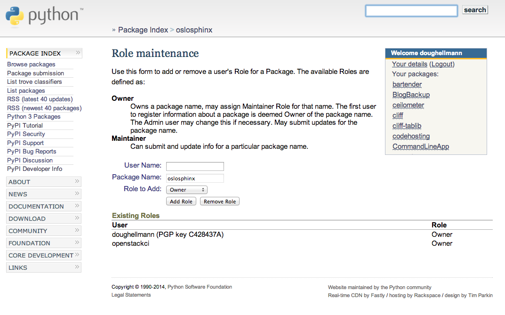

:title: Project Creator's Guide

=========================
 Project Creator's Guide
=========================

Before You Start
================

This is a long document. It's long because it has to be, not because
we want it to be. If you follow it, everything will be fine.

It is important that you perform all of the steps, in the order they
are given here. Don't skip any steps. Don't try to do things in
parallel. Don't jump around.

Set up Launchpad
================

Create a new Launchpad Project
------------------------------

Visit https://launchpad.net/projects/+new and fill in the details.

Name your project using the same name you plan to use for the git
repository, unless that is taken. Try "python-" as a prefix if
necessary (for example, "python-stevedore"). If that name is also
taken, consult with the Release Manager before going any further.

Put Your New Project in the Correct Project Group
-------------------------------------------------

From the Overview page of your project, select "Change Details" from
the right sidebar (e.g., http://launchpad.net/oslo.foo/+edit).

Find the "Part of" field and set the value to "openstack" for
integrated projects and "oslo" for Oslo libraries.

Save your changes.

Create Bug Tracker
------------------

From the Overview page for your project, click the "Bugs" link at the
top of the page. Launchpad should suggest that you set up bug
tracking.

Choose "In launchpad".

Check the box labeled "Expire 'Incomplete' bug reports when they
become inactive"

Check the box labeled "Search for possible duplicate bugs when a new
bug is filed"

Set the "Bug supervisor" field to "projectname-bugs" (for example,
"oslo-bugs").

.. note::

   You may need to create the bug management team in Launchpad.

Save your changes.

Create Blueprint Tracker
------------------------

From the Overview page for your project, click the "Blueprints" link
at the top of the page. Launchpad should suggest that you set up
blueprint tracking.

Choose "Launchpad".

Save your changes.

Set up Supervisors for your Project
-----------------------------------

From the Overview page for your project, click the pencil "edit" icon
next to the Maintainer field. Replace your name with the
projectname-drivers team (for example, "oslo-drivers").

.. note::

   You may need to create the drivers team.

From the Overview page for your project, click the pencil "edit" icon
next to the Drivers field. Replace your name with the project drivers
team.

.. note::

   If either of these steps makes it so you cannot edit the project,
   stop and ask someone in the drivers group to help you before
   proceeding.

Preparing a Git Repository
==========================

All OpenStack projects should use one of our cookiecutter_ templates
for creating an initial repository to hold the source for the project.

.. _cookiecutter: https://pypi.python.org/pypi/cookiecutter

::

  $ pip install cookiecutter

Choosing the cookiecutter Right Template
----------------------------------------

The template in ``openstack-dev/cookiecutter`` is suitable for
libraries not sharing the oslo namespace package.

::

  $ cookiecutter https://git.openstack.org/openstack-dev/cookiecutter

The template in ``openstack-dev/oslo-cookiecutter`` should be used for
Oslo libraries.

::

  $ cookiecutter https://git.openstack.org/openstack-dev/oslo-cookiecutter

Running cookiecutter will prompt you for several settings, based on
the template's configuration. It will then create a new directory
containing a project skeleton, ready to have your real project files
added. This directory needs to be turned into a git repository that
can be imported into the CI system in later steps. The simplest way to
do that is to push a copy to github or other public git server.

::

  $ cd projectname
  $ git init .
  $ git add .
  $ git commit -m "set up project with cookiecutter template"
  # add your project files
  $ git remote add origin git@github.com:username/projectname.git
  $ git push -u origin master

It is best if the repository is not imported into the CI system until
all of the relevant tests pass, since failing tests prevent other
changes from being merged.

Importing the Repository into the CI System
===========================================

To import the repository you've created into the CI System, you need
to modify some infrastructure configuration files using git and the
OpenStack gerrit review server.

openstack-infra/project-config
------------------------------

These instructions are based on the `steps for creating a new
Stackforge project`_ with some variations, and apply to changes made
in the `openstack-infra/project-config`_ git repository.

.. _steps for creating a new Stackforge project: http://ci.openstack.org/stackforge.html
.. _openstack-infra/project-config: http://git.openstack.org/cgit/openstack-infra/project-config

All of the changes described in this section should be submitted
together as one patchset. Refer to
https://review.openstack.org/#/c/124103/ for an example.

Add the project to the master project list
~~~~~~~~~~~~~~~~~~~~~~~~~~~~~~~~~~~~~~~~~~

Edit ``gerrit/projects.yaml`` to add a new section like::

  - project: openstack/projectname
    description: Latest and greatest cloud stuff.
    groups:
       - oslo
    upstream: git://github.com/awesumsauce/projectname.git

The projects in the file need to be listed in alphabetical order.

Provide a very brief description of the library.

Set the "groups" value to to the name of the Launchpad project group
where the existing Launchpad project exists. For example, use "oslo"
for Oslo libraries to ensure that they are associated with the
https://launchpad.net/oslo project group for tracking bugs and
milestones.

Set the "upstream" URL to the repository created earlier.

Add Gerrit permissions
~~~~~~~~~~~~~~~~~~~~~~

Each project should have 2 groups. The first, "projectname-core", is
the normal core group, with permission to +2 changes. The second,
"projectname-release" is a small group of the primary maintainers
with permission to push tags to trigger releases.

Create ``gerrit/acls/openstack/projectname.config``::

  [access "refs/heads/*"]
  label-Code-Review = -2..+2 group projectname-core
  label-Workflow = -1..+1 group projectname-core
  abandon = group projectname-core

  [access "refs/tags/*"]
  pushSignedTag = group projectname-release

  [receive]
  requireChangeId = true
  requireContributorAgreement = true

  [submit]
  mergeContent = true

See other files in the same directory for examples.

Add Basic Jenkins Jobs
~~~~~~~~~~~~~~~~~~~~~~

Establish the standard Python jobs, including publishing releases to
PyPI and pre-release tarballs to tarballs.openstack.org.

Edit ``jenkins/jobs/projects.yaml`` to add your project. There are
several sections, designated in comments, for different types of
projects. Find the right section and then add a new stanza like:

::

 - project:
    name: projectname
    node: 'bare-precise || bare-trusty'
    tarball-site: tarballs.openstack.org
    doc-publisher-site: docs.openstack.org
    jobs:
      - python-jobs
      - openstack-publish-jobs
      - pypi-jobs

.. warning::

   This page may be out of date by the time you reach this step. Look
   at a recently updated library to see how it was handled.

Configure Zuul to Run Jobs
~~~~~~~~~~~~~~~~~~~~~~~~~~

Zuul is the gate keeper. It watches for changes in gerrit to trigger
the appropriate jobs. To start, establish the rules for the basic jobs
already configured, but not the full devstack-gate jobs.

Edit ``zuul/layout.yaml`` to add your project. There are several
sections, designated in comments, for different types of
projects. Find the right section and then add a new stanza like:

::

  - name: openstack/projectname
    template:
      - name: merge-check
      - name: python-jobs
      - name: openstack-server-publish-jobs
      - name: check-requirements
      - name: integrated-gate
      - name: publish-to-pypi
      - name: python3-jobs
      - name: translation-jobs

.. warning::

   This page may be out of date by the time you reach this step. Look
   at a recently updated library to see how it was handled.

You can find more info about job templates in the beginning of
``zuul/layout.yaml`` in the section starting with
"project-templates:".

If you use ``pypi-jobs`` and ``publish-to-pypi``, please ensure your
project's namespace is registered on http://pypi.python.org. This will
be required before your patch is merged.

Configure GerritBot to Announce Changes
~~~~~~~~~~~~~~~~~~~~~~~~~~~~~~~~~~~~~~~

If you want changes proposed and merged to your project to be
announced on IRC, edit ``gerritbot/channels.yaml`` to add your new
repository to the list of projects. For example, to announce changes
related to an Oslo library, add it under openstack-oslo::

  openstack-oslo:
    events:
      - patchset-created
      - x-vrif-minus-2
    projects:
      - openstack/cliff
      - openstack/oslo.config
      - openstack/oslo-incubator
      - openstack/oslo.messaging
      - openstack/oslo.rootwrap
      - openstack/oslosphinx
      - openstack/oslo-specs
      - openstack/oslo.test
      - openstack/oslo.version
      - openstack/oslo.vmware
      - openstack/stevedore
      - openstack/taskflow
      - openstack-dev/cookiecutter
      - openstack-dev/hacking
      - openstack-dev/oslo-cookiecutter
      - openstack-dev/pbr
    branches:
      - master

Submitting Infra Change for Review
~~~~~~~~~~~~~~~~~~~~~~~~~~~~~~~~~~

.. note::

   When submitting the change to openstack-infra/project-config for
   review, use the "new-project" topic so it receives a high
   priority::

     $ git review -t new-project

Wait Here
~~~~~~~~~

The rest of the process needs this initial import to finish, so
coordinate with the Infra team, and read ahead, but don't do any of
these other steps until the import is complete and the new repository
is configured.

Update the Gerrit Group Members
~~~~~~~~~~~~~~~~~~~~~~~~~~~~~~~

After the review is approved and groups are created, ask the Infra
team to add you to both groups in gerrit, and then you can add other
members.

The project PTL, at least, should be added to "projectname-release",
and other developers who understand the release process can volunteer
to be added as well.

Updating devstack-vm-gate-wrap.sh
---------------------------------

Check out ``openstack-infra/devstack-gate`` and edit
``devstack-vm-gate-wrap.sh`` to add the new project::

  PROJECTS="openstack/projectname $PROJECTS"

Keep the list in alphabetical order.

See https://review.openstack.org/#/c/72487/ for an example.

.. note::

   No changes will land in the new repo until this is done, so wait
   for these changes to be accepted before proceeding.

Add Project to the Requirements Mirror List
-------------------------------------------

The global requirements repository (openstack/requirements) controls
which dependencies can be added to a project to ensure that all of
OpenStack can be installed together on a single system without
conflicts. It also automatically contributes updates to the
requirements lists for OpenStack projects when the global requirements
change.

Edit the ``projects.txt`` file to add the new library, adding
"openstack/projectname" in the appropriate place in alphabetical
order.

Refer to https://review.openstack.org/#/c/35845/ for an example.

Add Project to the Governance Repository
----------------------------------------

Each project managed by an official program in OpenStack needs to be
listed in ``reference/programs.yaml`` in the ``openstack/governance``
repository to indicate who owns the project so we know where ATCs
voting rights extend.

Find the appropriate section in ``reference/programs.yaml`` and add
the new project to the list. For example, to add a new Oslo library
edit the "Common Libraries" section::

 Common Libraries:
   codename: Oslo
   ptl: Doug Hellmann (dhellmann)
   mission:
     To produce a set of python libraries containing code shared by OpenStack
     projects. The APIs provided by these libraries should be high quality,
     stable, consistent, documented and generally applicable.
   url: https://wiki.openstack.org/wiki/Oslo
   projects:
     - openstack/oslo-incubator
     - openstack/oslo.config
     - openstack/oslo.messaging
     - openstack/oslo.rootwrap
     - openstack/oslo.sphinx
     - openstack/oslo.version
     - openstack-dev/cookiecutter
     - openstack-dev/hacking
     - openstack-dev/pbr

Verify That Gerrit and the Test Jobs are Working
================================================

The next step is to verify that you can submit a change request for
the repository.

#. Check that ``git review`` submits the patch to the right project.
#. Verify that the tests run successfully for the new patch.
#. Ensure that you have permission to approve changes.
#. Test that the release process works by tagging a release.

Prepare an Initial Release
==========================

Make Your Project Useful
------------------------

Before going any farther, make the project do something useful.

If you are importing an existing project with features, you can go
ahead.

If you are creating a brand new project, add some code and tests to
provide some minimal functionality.

Provide Basic Developer Documentation
-------------------------------------

Update the ``README.rst`` file to include a paragraph describing the
new project.

Update the rest of the documentation under ``doc/source`` with
information about the public API, tips on adopting the tool,
instructions for running the tests, etc.

Give OpenStack Permission to Publish Releases
---------------------------------------------

New project without any releases need to be manually registered on
PyPI.

If you already have PyPI credentials, visit
https://pypi.python.org/pypi?%3Aaction=submit_form and fill in only
the required fields.

If you do not have PyPI credentials, you can either create them or ask
another dev who has them to handle this step for you.

Next your project needs to be updated so the "openstackci" user has
"Owner" permissions.

Visit
https://pypi.python.org/pypi?:action=role_form&package_name=projectname
and add "openstackci" in the "User Name" field, set the role to Owner,
and click "Add Role".

Tagging a Release
-----------------

To verify that the release machinery works, push a signed tag to the
"gerrit" remote. Use the smallest version number possible. If this is
the first release, use "0.1.0". If other releases of the project
exist, choose an appropriate next version number.

Run::

  $ git tag -s -m "descriptive message" $version
  $ git push gerrit $version

Wait a little while for the pypi job to run and publish the release.

If you need to check the logs, you can use the `git-os-job`_ plugin::

  git os-job $version

.. _git-os-job: https://pypi.python.org/pypi/git-os-job

Allowing Other OpenStack Projects to Use Your Library
=====================================================

OpenStack projects share a common global requirements list so that all
components can be installed together on the same system. If you are
importing a new library project, you need to update that list to allow
other projects to use your library.

Update the Global Requirements List
-----------------------------------

Check out the ``openstack/requirements`` git repository and modify
``global-requirements.txt`` to:

#. add the new library
#. add any of the library's direct dependencies that are not already listed

See https://review.openstack.org/#/c/35845/ for an example.

Setting up Gate Testing
=======================

The devstack gate jobs install all OpenStack projects from source so
that the appropriate git revisions (head, or revisions in the merge
queue) are tested together. To include the new library in these tests,
it needs to be included in the list of projects in the devstack gate
wrapper script. For the same feature to work for developers outside of
the gate, the project needs to be added to the appropriate library
file of devstack.

Updating devstack
-----------------

Check out ``openstack-dev/devstack``.

Edit ``lib/oslo`` to add a variable defining where the source should go:

  NEWPROJECT_DIR=$DEST/newproject

Edit the :func:`install_oslo` function in ``lib/oslo`` to add commands
to check out the repository. The libraries need to be installed in
order so that the lower-level packages are installed first (this
avoids having a library installed from a package and then re-installed
from source)::

  function install_oslo() {
    ...
    git_clone $NEWPROJECT_REPO $NEWPROJECT_DIR $NEWPROJECT_BRANCH
    setup_develop $NEWPROJECT_DIR
    ...
  }

Edit ``stackrc`` to add the other variables needed for configuring the
new library::

  # new-project
  NEWPROJECT_REPO=${NEWPROJECT_REPO:-${GIT_BASE}/openstack/new-project.git}
  NEWPROJECT_BRANCH=${NEWPROJECT_BRANCH:-master}

See https://review.openstack.org/#/c/72437/ for an example.

.. note:: Wait for these changes to be accepted before proceeding.

Add Link to Your Developer Documentation
========================================

Update the http://docs.openstack.org/developer/openstack-projects.html
page with a link to your documentation by checking out the
``openstack/openstack-manuals`` repository and editing
``www/developer/openstack-projects.html``.
