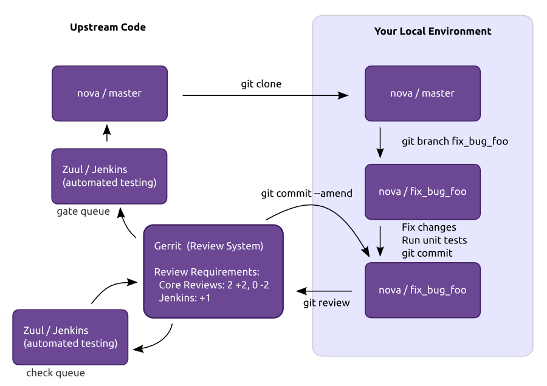

:title: Developer's Guide

.. _developer_manual:

Developer's Guide
#################

Quick Reference
===============

Getting Started
===============

Account Setup
-------------

You'll need a `Launchpad account <https://launchpad.net/+login>`_,
since this is how the Web interface for the Gerrit Code Review system
will identify you. This is also useful for automatically crediting bug
fixes to you when you address them with your code commits.

If you haven't already, `join The OpenStack Foundation
<https://www.openstack.org/join/>`_ (it's free and required for all
code contributors). Among other privileges, this also allows you to
vote in elections and run for elected positions within The OpenStack
Project. When signing up for Foundation Membership, make sure to give
the same email address you'll use for code contributions, since this
will need to match your preferred email address in Gerrit.

Visit https://review.openstack.org/ and click the ``Sign In`` link at
the top-right corner of the page.  Log in with your Launchpad ID.

The first time you sign into OpenStack's Gerrit (review.openstack.org),
you will be prompted to "Select a unique username:". Please enter your
Launchpad username.

Because Gerrit uses Launchpad OpenID single sign-on, you won't need a
separate password for Gerrit, and once you log in to one of Launchpad,
Gerrit, or any number of other OpenStack services, you won't have to
enter your password for the others.

Unless you are an U.S. Government Employee (see below), `agree to the
Individual Contributor License Agreement
<https://review.openstack.org/#/settings/agreements>`_ and provide
contact information. Your full name and email address will be public
(since they also appear in project commit logs) and the latter needs
to match the user.email in your Git configuration. The other contact
information (postal address, phone numbers) will be kept confidential
and is only used as a fallback record in the unlikely event The
OpenStack Foundation needs to reach you directly over code
contribution related matters. This contact information can also be
easily `updated <https://review.openstack.org/#/settings/contact>`_
later if desired, but make sure the primary email address always
matches the one you set for your OpenStack Foundation Membership --
otherwise Gerrit will give you an error message and refuse to accept
your contact information.

Employees of the the U.S. Government do not sign the Individual
CLA. Instead, someone with authority to sign on behalf of your agency
should sign the `U.S. Government Contributor License Agreement
<https://wiki.openstack.org/wiki/GovernmentCLA>`_. Please contact the
OpenStack Foundation to initiate this process.

If you are ``contributing on behalf of a company`` or organization,
you still need to sign the ICLA above but someone at your company or
organization also needs to sign the `Corporate Contributor License
Agreement <https://review.openstack.org/#/settings/agreements>`_
providing a list of people authorized to commit code to
OpenStack. Check `How to update the CCLA
<https://wiki.openstack.org/wiki/HowToUpdateCorporateCLA>`_ to provide
changes to such list. A list of current companies and organizations
with an existing `Corporate CLA
<https://wiki.openstack.org/wiki/Contributors/Corporate>`_ is available
for your review.

You'll also want to `upload an SSH key
<https://review.openstack.org/#/settings/ssh-keys>`_ while you're at
it, so that you'll be able to commit changes for review later.

Ensure that you have run these steps to let git know about your email
address::

  git config --global user.name "Firstname Lastname"
  git config --global user.email "your_email@youremail.com"
  git config --global user.editor "your preferred editor"

To check your git configuration::

  git config --list

Installing git-review
---------------------

We recommend using the ``git-review`` tool which is a git subcommand
that handles all the details of working with Gerrit, the code review
system used in OpenStack development.  Before you start work, make
sure you have git-review installed on your system.

On Ubuntu Precise (12.04) and later, git-review is included in the
distribution, so install it as any other package::

  apt-get install git-review

On Fedora 16 and later, git-review is included into the distribution,
so install it as any other package::

  yum install git-review

On Red Hat Enterprise Linux, you must first enable the `EPEL
<http://fedoraproject.org/wiki/EPEL>`_ repository, then install it as
any other package::

  yum install git-review

On openSUSE 12.2 and later, git-review is included in the distribution
under the name python-git-review, so install it as any other package::

  zypper in python-git-review

On MacOSx, or most other Unix-like systems, you may install it with
pip::

  pip install git-review

All of git-review's interactions with gerrit are sequences of normal
git commands. If you want to know more about what it's doing, just
add -v to the options and it will print out all of the commands it's
running.

Learn the Gerrit Workflow in the Sandbox
----------------------------------------

OpenStack has a sandbox repository for learning and testing purposes:
http://git.openstack.org/cgit/openstack-dev/sandbox/ This is a great
repository to begin your OpenStack learning. It allows you to experiment
with the workflow and try different options so you can learn what they do.
Please only create 2 or 3 different patches and submit new patchsets to those
few patches. Please don't create 10 or more patches, this is not what this
repo is designed for.

Clone the sandbox repo::

  git clone ``https://git.openstack.org/openstack-dev/sandbox``

Move into the root directory for the sandbox repo and configure git-review
so that it knows about Gerrit. If you don't, it will do so the first time you
submit a change for review, but you probably want to do this ahead of
time so the Gerrit Change-Id commit hook gets installed.  To do so::

  cd sandbox
  git review -s

Git-review checks that you can log in to gerrit with your ssh key. It
assumes that your gerrit/launchpad user name is the same as the
current running user.  If that doesn't work, it asks for your
gerrit/launchpad user name.  You can avoid that question by
configuring git to use your Gerrit username, as follows::

  git config --global gitreview.username yourgerritusername

If you don't remember your Gerrit user name go to the `settings page
on gerrit <https://review.openstack.org/#/settings/>`_ to check it out
(it's not your email address).

Note that you can verify the SSH host keys for review.openstack.org
here: https://review.openstack.org/#/settings/ssh-keys

Create a git branch locally from the sandbox repo master branch::

  git checkout -b <new-branch>

Create a new file, add some content and save the file.
Run::

  git status

and stage your changes with::

  git add <filename>

or::

  git add .

or::

  git add -a

Next commit your change with::

  git commit

this will take you into your editor which you set in the git configuration
above. `Create a title for your commit message and add some text in the body.
<https://wiki.openstack.org/wiki/GitCommitMessages#Summary_of_GIT_commit_message_structure>`_
Then save the file and close the editor. Next submit your patch to gerrit::

  git review

You will get some output including a URL to your patch, click on the URL
and view your patch.

Now create a second patchset, in the same git branch as your first patchset,
make some changes, either create a new file or add or delete content in your
first file. Save your changes and stage them. To ensure you submit your new
patchset to the same change execute::

  git commit --amend

this takes you into your prior git commit message, which you can edit but you
don't have to, then save and close the editor containing the commit message.
Then run::

  git review

and again you should see a url that links to your patch. Viewing the patch
you should see a new patchset as patchset 2 below your original patchset 1,
you should not see a new change.

Development Workflow
====================

Working on Bugs
---------------

TODO: Finding a bug in launchpad and assigning it to yourself.

Working on Blueprints
---------------------

TODO: Spec process.

Starting a Change
-----------------

Once your local repository is set up as above, you must use the
following workflow.

Make sure you have the latest upstream changes::

  git remote update
  git checkout master
  git pull --ff-only origin master

Create a `topic branch
<http://git-scm.com/book/en/Git-Branching-Branching-Workflows#Topic-Branches>`_
to hold your work and switch to it.  If you are working on a
blueprint, name your topic branch ``bp/BLUEPRINT`` where BLUEPRINT is
the name of a blueprint in launchpad (for example,
``bp/authentication``).  The general convention when working on bugs
is to name the branch ``bug/BUG-NUMBER`` (for example,
``bug/1234567``). Otherwise, give it a meaningful name because it will
show up as the topic for your change in Gerrit::

  git checkout -b TOPIC-BRANCH

Committing a Change
-------------------

`Git commit messages
<https://wiki.openstack.org/wiki/GitCommitMessages>`_ should start
with a short 50 character or less summary in a single paragraph.  The
following paragraph(s) should explain the change in more detail.

If your changes addresses a blueprint or a bug, be sure to mention them in the commit message using the following syntax::

  Implements: blueprint BLUEPRINT
  Closes-Bug: ####### (Partial-Bug or Related-Bug are options)

For example::

  Adds keystone support

  ...Long multiline description of the change...

  Implements: blueprint authentication
  Closes-Bug: #123456
  Change-Id: I4946a16d27f712ae2adf8441ce78e6c0bb0bb657

Note that in most cases the Change-Id line should be automatically
added by a Gerrit commit hook installed by git-review.  If you already
made the commit and the Change-Id was not added, do the Gerrit setup
step and run: ``git commit --amend``. The commit hook will
automatically add the Change-Id when you finish amending the commit
message, even if you don't actually make any changes.

Make your changes, commit them, and submit them for review::

  git commit -a

Caution: Do not check in changes on your master branch.  Doing so will
cause merge commits when you pull new upstream changes, and merge
commits will not be accepted by Gerrit.

Submitting a Change for Review
------------------------------

Once you have committed a change to your local repository, all you
need to do to send it to Gerrit for code review is run::

  git review

When that completes, automated tests will run on your change and other
developers will peer review it.

Updating a Change
-----------------
If the code review process suggests additional changes, make and amend
the changes to the the existing commit. Leave the existing Change-Id:
footer in the commit message as-is. Gerrit knows that this is an
updated patch for an existing change::

  git commit -a --amend
  git review

Squashing Changes
-----------------
If you have made many small commits, you should squash them so that
they do not show up in the public repository. Remember: each commit
becomes a change in Gerrit, and must be approved separately. If you
are making one "change" to the project, squash your many "checkpoint"
commits into one commit for public consumption. Here's how::

  git checkout master
  git pull origin master
  git checkout TOPIC-BRANCH
  git rebase -i master

Use the editor to squash any commits that should not appear in the
public history. If you want one change to be submitted to Gerrit, you
should only have one "pick" line at the end of this process. After
completing this, you can prepare your public commit message(s) in your
editor. You start with the commit message from the commit that you
picked, and it should have a Change-Id line in the message. Be sure to
leave that Change-Id line in place when editing.

Once the commit history in your branch looks correct, run git review
to submit your changes to Gerrit.

Adding a Dependency
-------------------
When you want to start new work that is based on the commit under the
review, you can add the commit as a dependency.

Fetch change under review and check out branch based on that change::

  git review -d $PARENT_CHANGE_NUMBER
  git checkout -b $DEV_TOPIC_BRANCH

Edit files, add files to git::

  git commit -a
  git review

NOTE: git review rebases the existing change (the dependency) and the
new commit if there is a conflict against the branch they are being
proposed to. Typically this is desired behavior as merging cannot
happen until these conflicts are resolved. If you don't want to deal
with new patchsets in the existing change immediately you can pass
the -R option to git review in the last step above to prevent
rebasing. This requires future rebasing to resolve conflicts.

If the commit your work depends on is updated, and you need to get the
latest patch from the depended commit, you can do the following.

Fetch and checkout the parent change::

  git review -d $PARENT_CHANGE_NUMBER

Cherry-pick your commit on top of it::

  git review -x $CHILD_CHANGE_NUMBER

Submit rebased change for review::

  git review

The note for the previous example applies here as well. Typically you
want the rebase behavior in git review. If you would rather postpone
resolving merge conflicts you can use git review -R as the last step
above.

Code Review
===========

Log in to https://review.openstack.org/ to see proposed changes, and
review them.

To provide a review for a proposed change in the Gerrit UI, click on
the Review button (it will be next to the buttons that will provide
unified or side-by-side diffs in the browser). In the code review, you
can add a message, as well as a vote (+1,0,-1).

Any Openstack developer may propose or comment on a change (including
voting +1/0/-1 on it). Openstack projects have a policy requiring two
positive reviews from core reviewers. A vote of +2 is allowed from
core reviewers, and should be used to indicate that they are a core
reviewer and are leaving a vote that should be counted as such.

When a review has two +2 reviews and one of the core team believes it
is ready to be merged, he or she should leave a +1 vote in the
"Approved" category. You may do so by clicking the "Review" button
again, with or without changing your code review vote and optionally
leaving a comment. When a +1 Approved review is received, Jenkins will
run tests on the change, and if they pass, it will be merged.

A green checkmark indicates that the review has met the requirement
for that category. Under "Code-Review", only one +2 gets the green
check.

Automated Testing
-----------------

When a new patchset is uploaded to Gerrit, that project's "check"
tests are run on the patchset by Jenkins. Once completed the test
results are reported to Gerrit by Jenkins in the form of a Verified:
+/-1 vote. After code reviews have been completed and a change
receives an Approved: +1 vote that project's "gate" tests are run on
the change by Jenkins. Jenkins reports the results of these tests back
to Gerrit in the form of a Verified: +/-2 vote. Code merging will only
occur after the gate tests have passed successfully and received a
Verified: +2. You can view the state of tests currently being run on
the Zuul Status.

If a change fails tests in Jenkins, please follow the steps below:

1. Jenkins leaves a comment in the review with links to the log files for the test run. Follow those links and examine the output from the test. It will include a console log, and in the case of unit tests, HTML output from the test runner, or in the case of a devstack-gate test, it may contain quite a large number of system logs.
2. Examine the console log or other relevant log files to determine the cause of the error. If it is related to your change, you should fix the problem and upload a new patchset. Do not use "recheck" or "reverify".
3. If the problem is due to non-deterministic behavior already merged, and is unrelated to your change, you should do the following to help other developers who may be affected by the same issue, and to focus attention of QA, CI, and other developers working to fix high-impact bugs and improve test systems:

  1. Visit http://status.openstack.org/elastic-recheck/ to see if one of the bugs listed there matches the error you've seen. If your error isn't there, then:
  2. Identify which project(s) are affected, and search for a related bug on Launchpad. You can search for bugs affecting all OpenStack Programs here: https://bugs.launchpad.net/openstack/ If you do not find an existing bug, file a new one (and be sure to include the error message and a link to the logs for the failure). If the problem is due to an infrastructure problem (such as Jenkins, Gerrit, etc.), file (or search for) the bug against the openstack-ci project.

4. To re-run check or gate jobs, leave a comment on the review referencing the bug causing the transient failure (not the bug you're attempting to fix with your patch):

  1. To re-run the check jobs (before a change has been approved), leave a comment with the form "recheck bug ####".
  2. To re-run the gate jobs (after a change has been approved), leave a comment with the form "reverify bug ####".

5. If a nice message from Elastic Recheck didn't show up in your patch when Jenkins failed, and you've identified a bug to recheck/reverify against, help out by writing an `elastic-recheck query <http://docs.openstack.org/infra/elastic-recheck/readme.html>`_ for the bug.

If you need to re-run tests and it does not make sense to include a bug number (perhaps there is no error or you're updating test results because you know that a related branch has changed since the last time they were run), you may leave a comment with the form "recheck no bug". Please only do this if you are certain there is no bug that needs to be addressed. A bug number is required to reverify.

Peer Review
-----------

https://wiki.openstack.org/wiki/ReviewChecklist

Work in Progress
----------------

TODO

Merging
=======

TODO

Project Gating
--------------

TODO
