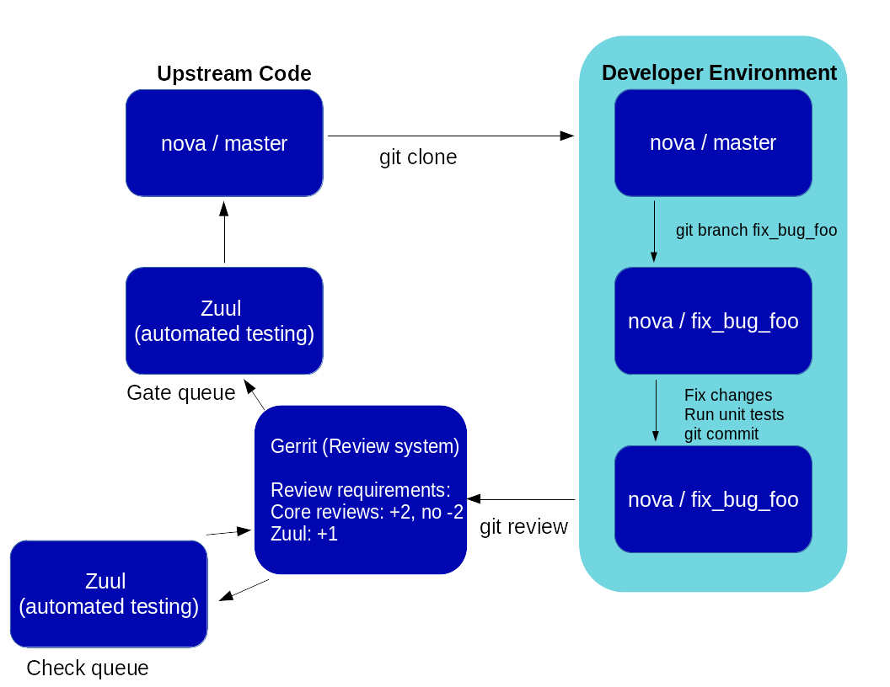

:title: Developer's Guide

.. _developer_manual:

Developer's Guide
#################

Quick Reference
===============

Getting Started
===============

The goal of this document is to walk you through the concepts and
specifics that should be understood while contributing to OpenStack.

Prior to contributing to an OpenStack project a few steps need to be
completed. This document covers the steps that get you started, such as
creating a few accounts on required websites, signing a contributor
license agreement, uploading an ssh key, and installing git-review.

Account Setup
-------------

You'll need a `Launchpad account <https://launchpad.net/+login>`_,
since this is how the Web interface for the Gerrit Code Review system
will identify you. This is also useful for automatically crediting bug
fixes to you when you address them with your code commits.

If you haven't already, `join The OpenStack Foundation
<https://www.openstack.org/join/>`_ (it's free and required for all
code contributors). Among other privileges, this also allows you to
vote in elections and run for elected positions within The OpenStack
Project. When signing up for Foundation Membership, make sure to give
the same email address you'll use for code contributions, since this
will need to match your preferred email address in Gerrit.

Visit https://review.openstack.org/ and click the ``Sign In`` link at
the top-right corner of the page.  Log in with your Launchpad ID.

The first time you sign into OpenStack's Gerrit (review.openstack.org),
you will be prompted to "Select a unique username:". Please enter your
Launchpad username.

Because Gerrit uses Launchpad OpenID single sign-on, you won't need a
separate password for Gerrit, and once you log in to one of Launchpad,
Gerrit, or any number of other OpenStack services, you won't have to
enter your password for the others.

Sign the appropriate Individual Contributor License Agreement
~~~~~~~~~~~~~~~~~~~~~~~~~~~~~~~~~~~~~~~~~~~~~~~~~~~~~~~~~~~~~

Unless you are an U.S. Government Employee (see below),
`agree to the Individual Contributor License
Agreement <https://review.openstack.org/#/settings/agreements>`_ and
provide contact information. The full text of the agreement will be
displayed before you can enter "I AGREE" below it, but it's also
anonymously available if you want to `preview the OpenStack
ICLA <https://review.openstack.org/static/cla.html>`_ now. Your full name
and email address will be public (since they also appear in project commit
logs) and the latter needs to match the user.email in your Git
configuration. The other contact information (postal address, phone
numbers) will be kept confidential and is only used as a fallback record in
the unlikely event The OpenStack Foundation needs to reach you directly
over code contribution related matters. This contact information can also
be easily `updated <https://review.openstack.org/#/settings/contact>`_
later if desired, but make sure the primary email address always matches
the one you set for your OpenStack Foundation Membership -- otherwise
Gerrit will give you an error message and refuse to accept your contact
information.

Employees of the U.S. Government do not sign the Individual
CLA. Instead, someone with authority to sign on behalf of your agency
should sign the `U.S. Government Contributor License Agreement
<https://wiki.openstack.org/wiki/GovernmentCLA>`_. Please contact the
OpenStack Foundation to initiate this process.

If you are ``contributing on behalf of a company`` or organization,
you still need to sign the ICLA above but someone at your company or
organization also needs to sign the `Corporate Contributor License
Agreement <https://secure.echosign.com/public/hostedForm?formid=56JUVGT95E78X5>`_
providing a list of people authorized to commit code to
OpenStack. If you need a printable copy of the Corporate CLA please
email `community managers <mailto:communitymngr@openstack.org>`_.
Check `How to update the CCLA <https://wiki.openstack.org/wiki/HowToUpdateCorporateCLA>`_
to provide changes to such list. A list of current companies and
organizations with an existing `Corporate CLA <https://wiki.openstack.org/wiki/Contributors/Corporate>`_
is available for your review.

You'll also want to `upload an SSH key to Gerrit at review.openstack.org
<https://review.openstack.org/#/settings/ssh-keys>`_ while you're at
it, so that you'll be able to commit changes for review later. This is
different from adding a key to Launchpad.

Ensure that you have run these steps to let git know about your email
address::

  git config --global user.name "Firstname Lastname"
  git config --global user.email "your_email@youremail.com"

To check your git configuration::

  git config --list

Installing git-review
---------------------

We recommend using the ``git-review`` tool which is a git subcommand
that handles all the details of working with Gerrit, the code review
system used in OpenStack development.  Before you start work, make
sure you have git-review installed on your system.

On Ubuntu Precise (12.04) and later, git-review is included in the
distribution, so install it as any other package::

  apt-get install git-review

On Fedora 16 and later, git-review is included into the distribution,
so install it as any other package::

  yum install git-review

On Red Hat Enterprise Linux, you must first enable the `EPEL
<http://fedoraproject.org/wiki/EPEL>`_ repository, then install it as
any other package::

  yum install git-review

On openSUSE 12.2 and later, git-review is included in the distribution
under the name python-git-review, so install it as any other package::

  zypper in python-git-review

On Mac OS X, or most other Unix-like systems, you may install it with
`pip <http://pip.readthedocs.org/en/latest/installing.html>`_::

  pip install git-review

If you run into trouble, you can refer to the `git-review readme file
<http://git.openstack.org/cgit/openstack-infra/git-review/tree/README.rst>`_.

All of git-review's interactions with gerrit are sequences of normal
git commands. If you want to know more about what it's doing, just
add -v to the options and it will print out all of the commands it's
running.

Starting Work on a New Project
------------------------------

Clone a project in the usual way, for example::

  git clone https://git.openstack.org/openstack/nova.git

You may want to ask git-review to configure your project to know about
Gerrit at this point.  If you don't, it will do so the first time you
submit a change for review, but you probably want to do this ahead of
time so the Gerrit Change-Id commit hook gets installed.  To do so
(again, using Nova as an example)::

  cd nova
  git review -s

Git-review checks that you can log in to gerrit with your ssh key. It
assumes that your gerrit/launchpad user name is the same as the
current running user.  If that doesn't work, it asks for your
gerrit/launchpad user name.  You can avoid that question by
configuring git to use your Gerrit username, as follows::

  git config --global gitreview.username yourgerritusername

If you don't remember your Gerrit user name go to the `settings page
on gerrit <https://review.openstack.org/#/settings/>`_ to check it out
(it's not your email address).

.. Note:: You can verify the SSH host keys for review.openstack.org
    on https://review.openstack.org/#/settings/ssh-keys

Development Workflow
====================

Working on Bugs
---------------

Bug reports for a program or project are tracked on Launchpad at
https://bugs.launchpad.net/<projectname>. Contributors may review these
reports regularly when looking for work to complete.

There are 4 key tasks with regards to bugs that anyone can do:

 #. Confirm new bugs: When a bug is filed, it is set to the "New" status.
    A "New" bug can be marked "Confirmed" once it has been reproduced
    and is thus confirmed as genuine.
 #. Solve inconsistencies: Make sure bugs are Confirmed, and if assigned
    that they are marked "In Progress"
 #. Review incomplete bugs: See if information that caused them to be marked
    "Incomplete" has been provided, determine if more information is required
    and provide reminders to the bug reporter if they haven't responded after
    2-4 weeks.
 #. Review stale In Progress bugs: Work with assignee of bugs to determine
    if the bug is still being worked on, if not, unassign them and mark them
    back to Confirmed or Triaged.

Learn more about working with bugs for various projects at:

https://wiki.openstack.org/wiki/BugTriage

Bug statuses are documented here:

https://wiki.openstack.org/wiki/Bugs

If you find a bug that you wish to work on, you may assign it to yourself.
When you upload a review, include the bug in the commit message for
automatic updates back to Launchpad. The following options are available::

  Closes-Bug: #######
  Partial-Bug: #######
  Related-Bug: #######

Also see the `Including external references
<https://wiki.openstack.org/wiki/GitCommitMessages#Including_external_references>`_
section of the OpenStack Git Commit Good Practices wiki page.

Working on Specifications and Blueprints
----------------------------------------

Many OpenStack projects and programs have a <project>-specs respository which
is used to hold approved design specifications for additions and changes to
the project or program.

The layout of the repository will typically be something like::

  specs/<release>/

It may also have subdirectories to make clear which specifications are approved
and which have already been implemented:

  specs/<release>/approved
  specs/<release>/implemented

You can typically find an example spec in ``specs/template.rst``.

Check the repository for the project or program you're working on for specifics
about repository organization.

Specifications are proposed for a given release by adding them to the
``specs/<release>`` directory and posting it for review.  The implementation
status of a blueprint for a given release can be found by looking at the
blueprint in Launchpad.  Not all approved blueprints will get fully implemented.

Specifications have to be re-proposed for every release.  The review may be
quick, but even if something was previously approved, it should be re-reviewed
to make sure it still makes sense as written.

Historically, Launchpad blueprints were used to track the implementation of
these significant features and changes in OpenStack. For many projects and
programs, these Launchpad blueprints are still used for tracking the current
status of a specification. For more information, see `the Blueprints wiki page
<https://wiki.openstack.org/wiki/Blueprints>`_.

View all approved project and program specifications at
http://specs.openstack.org/.

Starting a Change
-----------------

Once your local repository is set up as above, you must use the
following workflow.

Make sure you have the latest upstream changes::

  git remote update
  git checkout master
  git pull --ff-only origin master

Create a `topic branch
<http://git-scm.com/book/en/Git-Branching-Branching-Workflows#Topic-Branches>`_
to hold your work and switch to it.  If you are working on a
blueprint, name your topic branch ``bp/BLUEPRINT`` where BLUEPRINT is
the name of a blueprint in launchpad (for example,
``bp/authentication``).  The general convention when working on bugs
is to name the branch ``bug/BUG-NUMBER`` (for example,
``bug/1234567``). Otherwise, give it a meaningful name because it will
show up as the topic for your change in Gerrit::

  git checkout -b TOPIC-BRANCH

Committing a Change
-------------------

`Git commit messages
<https://wiki.openstack.org/wiki/GitCommitMessages>`_ should start
with a short 50 character or less summary in a single paragraph.  The
following paragraph(s) should explain the change in more detail.

If your changes addresses a blueprint or a bug, be sure to mention them in the commit message using the following syntax::

  Implements: blueprint BLUEPRINT
  Closes-Bug: ####### (Partial-Bug or Related-Bug are options)

For example::

  Adds keystone support

  ...Long multiline description of the change...

  Implements: blueprint authentication
  Closes-Bug: #123456
  Change-Id: I4946a16d27f712ae2adf8441ce78e6c0bb0bb657

Note that in most cases the Change-Id line should be automatically
added by a Gerrit commit hook installed by git-review.  If you already
made the commit and the Change-Id was not added, do the Gerrit setup
step and run: ``git commit --amend``. The commit hook will
automatically add the Change-Id when you finish amending the commit
message, even if you don't actually make any changes. Do not change
the Change-Id when amending a change as that will confuse Gerrit.

Make your changes, commit them, and submit them for review::

  git commit -a

.. Note:: Do not check in changes on your master branch.  Doing so will
    cause merge commits when you pull new upstream changes, and merge
    commits will not be accepted by Gerrit.

Submitting a Change for Review
------------------------------

Once you have committed a change to your local repository, all you
need to do to send it to Gerrit for code review is run::

  git review

When that completes, automated tests will run on your change and other
developers will peer review it.

Updating a Change
-----------------
If the code review process suggests additional changes, make and amend
the changes to the existing commit. Leave the existing Change-Id:
footer in the commit message as-is. Gerrit knows that this is an
updated patchset for an existing change::

  git commit -a --amend
  git review

Understanding Changes and Patch Sets
^^^^^^^^^^^^^^^^^^^^^^^^^^^^^^^^^^^^

It's important to understand how Gerrit handles changes and patch
sets. Gerrit combines the Change-Id in the commit message, the
project, and the target branch to uniquely identify a change.

A new patch set is determined by any modification in the commit
hash. When a change is initially pushed up it only has one patch
set. When an update is done for that change, ``git commit --amend``
will change the most current commit's hash because it is essentially a
new commit with the changes from the previous state combined with the
new changes added. Since it has a new commit hash, once a ``git
review`` is successfully processed, a new patch set appears in Gerrit.

Since a patch set is determined by a modification in the commit hash,
many git commands will cause new patch sets. Three common ones that do
this are:

  * ``git commit --amend``
  * ``git rebase``
  * ``git cherry-pick``

Squashing Changes
-----------------
If you have made many small commits, you should squash them so that
they do not show up in the public repository. Remember: each commit
becomes a change in Gerrit, and must be approved separately. If you
are making one "change" to the project, squash your many "checkpoint"
commits into one commit for public consumption. Here's how::

  git checkout master
  git pull origin master
  git checkout TOPIC-BRANCH
  git rebase -i master

Use the editor to squash any commits that should not appear in the
public history. If you want one change to be submitted to Gerrit, you
should only have one "pick" line at the end of this process. After
completing this, you can prepare your public commit message(s) in your
editor. You start with the commit message from the commit that you
picked, and it should have a Change-Id line in the message. Be sure to
leave that Change-Id line in place when editing.

Once the commit history in your branch looks correct, run git review
to submit your changes to Gerrit.

Adding a Dependency
-------------------
When you want to start new work that is based on the commit under the
review, you can add the commit as a dependency.

Fetch change under review and check out branch based on that change::

  git review -d $PARENT_CHANGE_NUMBER
  git checkout -b $DEV_TOPIC_BRANCH

Edit files, add files to git::

  git commit -a
  git review

.. Note:: git review rebases the existing change (the dependency) and the
    new commit if there is a conflict against the branch they are being
    proposed to. Typically this is desired behavior as merging cannot
    happen until these conflicts are resolved. If you don't want to deal
    with new patchsets in the existing change immediately you can pass
    the ``-R`` option to git review in the last step above to prevent
    rebasing. This requires future rebasing to resolve conflicts.

If the commit your work depends on is updated, and you need to get the
latest patchset from the depended commit, you can do the following.

Fetch and checkout the parent change::

  git review -d $PARENT_CHANGE_NUMBER

Cherry-pick your commit on top of it::

  git review -x $CHILD_CHANGE_NUMBER

Submit rebased change for review::

  git review

The note for the previous example applies here as well. Typically you
want the rebase behavior in git review. If you would rather postpone
resolving merge conflicts you can use git review ``-R`` as the last step
above.

Cross-Project Dependencies
--------------------------

If your change has a dependency on a change outside of a project, like
a change for another project or some manual setup, here are some best
practices on marking those changes so that they merge at the right
time.

* As a developer, mark your change with the "Work in Progress" label
  until the dependencies are in.

* Add this header line to the commit message of a change which depends
  on a change in another project::

    Depends-On: <Gerrit Change-Id>

* Use the same topic for all changes. This allows to easily find all
  changes across repositories.

* A core reviewer might block an important change with a -2 so that it
  does not get merged accidentally.

Code Review
===========

Log in to https://review.openstack.org/ to see proposed changes, and
review them.

To provide a review for a proposed change in the Gerrit UI, click on
the Review button (it will be next to the buttons that will provide
unified or side-by-side diffs in the browser). In the code review, you
can add a message, as well as a vote (+1,0,-1).

It's also possible to add comments to specific lines in the file, for
giving context to the comment. For that look at the diff of changes
done in the file (click the file name), and click on the line number
for which you want to add the inline comment. After you add one or
more inline comments, you still have to send the Review message (see
above, with or without text and vote). Prior to sending the inline
comments in a review comment the inline comments are stored as Drafts
in your browser. Other reviewers can only see them after you have
submitted them as a comment on the patchset.

Any OpenStack developer may propose or comment on a change (including
voting +1/0/-1 on it). OpenStack projects have a policy requiring two
positive reviews from core reviewers. A vote of +2 is allowed from
core reviewers, and should be used to indicate that they are a core
reviewer and are leaving a vote that should be counted as such.

When a review has two +2 reviews and one of the core team believes it
is ready to be merged, he or she should leave a +1 vote in the
"Approved" category. You may do so by clicking the "Review" button
again, with or without changing your code review vote and optionally
leaving a comment. When a +1 Approved review is received, Jenkins will
run tests on the change, and if they pass, it will be merged.

A green checkmark indicates that the review has met the requirement
for that category. Under "Code-Review", only one +2 gets the green
check.

For more details on reviews in Gerrit, check the
`Gerrit documentation
<https://review.openstack.org/Documentation/intro-quick.html#_reviewing_the_change>`_.

.. _automated-testing:

Automated Testing
-----------------

When a new patchset is uploaded to Gerrit, that project's "check"
tests are run on the patchset by Jenkins. Once completed the test
results are reported to Gerrit by Jenkins in the form of a Verified:
+/-1 vote. After code reviews have been completed and a change
receives an Approved: +1 vote that project's "gate" tests are run on
the change by Jenkins. Jenkins reports the results of these tests back
to Gerrit in the form of a Verified: +/-2 vote. Code merging will only
occur after the gate tests have passed successfully and received a
Verified: +2. You can view the state of tests currently being run on
the `Zuul Status page <http://status.openstack.org/zuul>`_.

If a change fails tests in Jenkins, please follow the steps below:

1. Jenkins leaves a comment in the review with links to the log files
   for the test run. Follow those links and examine the output from
   the test. It will include a console log, and in the case of unit
   tests, HTML output from the test runner, or in the case of a
   devstack-gate test, it may contain quite a large number of system
   logs.
2. Examine the console log or other relevant log files to determine
   the cause of the error. If it is related to your change, you should
   fix the problem and upload a new patchset. Do not use "recheck".
3. It may be the case that the problem is due to non-deterministic
   behavior unrelated to your change that has already merged. In this
   situation, you can help other developers and focus the attention of
   QA, CI, and developers working on a fix by performing the following
   steps:

  1. Visit http://status.openstack.org/elastic-recheck/ to see if one
     of the bugs listed there matches the error you've seen. If your
     error isn't there, then:
  2. Identify which project(s) are affected, and search for a related
     bug on Launchpad. You can search for bugs affecting all OpenStack
     Programs here: https://bugs.launchpad.net/openstack/ If you do
     not find an existing bug, file a new one (be sure to include
     the error message and a link to the logs for the failure). If the
     problem is due to an infrastructure problem (such as Jenkins or
     Gerrit), file (or search for) the bug against the openstack-gate
     project.

4. To re-run check or gate jobs, leave a comment on the review
   with the form "recheck".

5. If a nice message from Elastic Recheck didn't show up in your change
   when Jenkins failed, and you've identified a bug to recheck
   against, help out by writing an `elastic-recheck query
   <http://docs.openstack.org/infra/elastic-recheck/readme.html>`_ for
   the bug.

If the patchset has failed a gate job and thus is approved, a recheck
will first run the check jobs and if those pass, it will run again the
gate jobs. There is no way to only run the gate jobs, the check jobs
will first be run again.

Peer Review
-----------

Anyone can be a reviewer: participating in the review process is a
great way to learn about OpenStack social norms and the development
processes. Some things are necessary to keep in mind when doing code
reviews:

1. The code should comply with everything in that project's
   `HACKING.rst` file, if it has one. If the project reuses nova's
   hacking guideines, then it may have a "hacking" section in its
   `tox.ini` file in which case much of this is already checked
   automatically for you by the continuous integration system.
2. The code should be 'pythonic' and look like the code around it,
   to make the code more uniform and easier to read.
3. Commit message and change break-up:

  1. Learn the best practices for `git commit messages <https://wiki.openstack.org/wiki/GitCommitMessages>`_.
  2. Use the `"DocImpact"
     <https://wiki.openstack.org/wiki/Documentation/DocImpact>`_ tag on
     changes that affect documentation.
  3. Use the "SecurityImpact" tag on changes that should get the
     attention of the OpenStack Security Group (OSSG) for additional
     review.
  4. Use the "UpgradeImpact" tag on changes which require
     configuration changes to be mentioned in the release notes.
  5. Use the "APIImpact" tag on changes impacting `API stability <https://wiki.openstack.org/wiki/APIChangeGuidelines>`_.
  6. If the change fixes a bug, it should include the bug number. For
     example, add the line "Fixes Bug: 1234".
  7. If the change implements a feature, it should reference a
     blueprint. The blueprint should be approved before the change is
     merged. For example, add the line "Blueprint: my-blueprint."

4. Test case implementation (Mock vs. Mox):

   1. New test cases should be implemented using Mock. It is part
      of the Python standard library in Python 3 and as such is the
      preferred method for OpenStack.
   2. Exceptions can be made for tests added where Mox was already
      in use, or any other situation where using Mock would cause excessive
      difficulty for some reason.
   3. There is no need to convert existing Mox test cases to Mock,
      but if you are changing a Mox test case anyway, please consider
      converting it to Mock at the same time.

5. About Python 3 compatibility:

   1. It is preferred for new code to use package six. When it is
      possible we should be use `six.text_type` or `six.text_binary` to cast
      or test value for unicode or str.

6. The code should comply with the community `logging standards <https://wiki.openstack.org/wiki/LoggingStandards>`_.

There may be more specific items to be aware of inside the projects'
documentation for contributors.

Contributors may notice a review that has several +1's from other
reviewers, passes the functional tests, etc. but the code still has
not been merged. As only core contributors can approve code for
merging, you can help things along by getting a core developer's
attention in IRC (never on the mailing lists) and letting them know
there is a changeset with lots of positive reviews and needs final
approval.

Work in Progress
----------------

To get early feedback on a change which is not fully finished yet, you
can submit a change to gerrit and mark it as "Work in Progress" (WIP).

.. note::
   The OpenStack Gerrit system does not support drafts, use
   "Work in Progress" instead.

To do so, after submitting a change to gerrit in usual way (``git review``),
You should go to gerrit, and do `Code Review`_ of your own change while
setting "Workflow" vote to "-1", which marks the change as WIP.

This allows others to review the change, while at the same time
blocking it from being merged, as you already plan to continue working on it.

.. note:: After uploading a new patchset, this -1 (WIP) vote disappears.
    So if you still plan to do additional changes, do not forget to
    set Workflow to -1 on the new patchset.

Merging
=======

Once a change has been approved and passed the gate jobs, Gerrit
automatically merges the latest patchset.

Each patchset gets merged to the head of the branch before testing it. If
Gerrit cannot merge a patchset, it will give a -1 review and add a
comment notifying of merge failure.

Each time a change merges, the "merge-check" pipeline verifies that
all open changes on the same project are still mergeable. If any job
is not mergeable, Jenkins will give a -1 review and add a comment
notifying of merge failure.

After a change is merged, project specific post jobs are run. Most
often the post jobs publish documentation, run coverage, or send
strings to the translation server.

Project Gating
--------------

TODO
